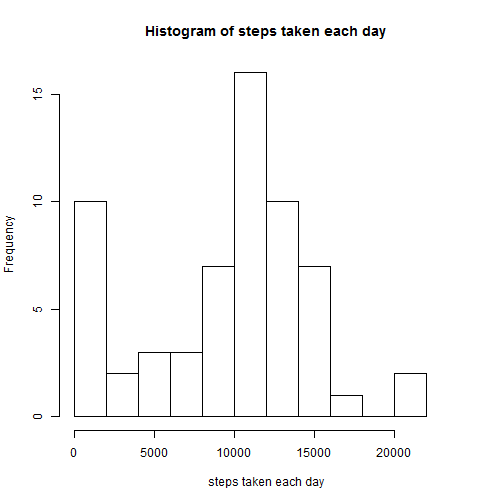
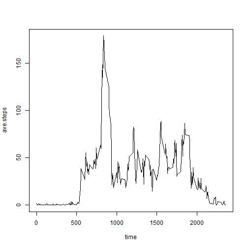
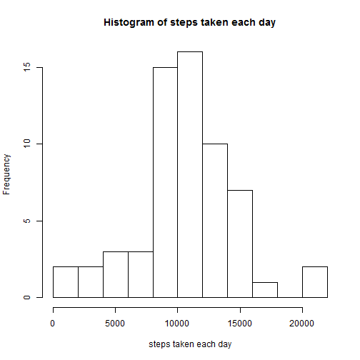
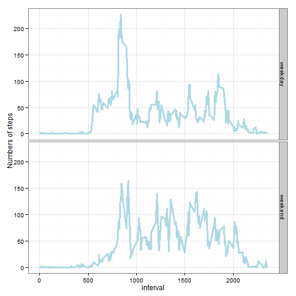

# Reproducible Research: Peer Assessment 1
=================================================================

## Loading and preprocessing the data
-----------------------------------------------------------------


```r
rm(list = ls())
setwd('D:/coursera/reproducible//pa1/RepData_PeerAssessment1/')
library(ggplot2)
data <- read.csv('data/activity.csv')
data$date <- as.Date(as.character(data$date))
```


## What is mean total number of steps taken per day?
-----------------------------------------------------------------
First, let's make a histogram of the total number of steps taken each day.

```r
data$day.number <-  as.factor(rep(1:61, each=288))
data$interval <- as.factor(data$interval)
temp.res <- aggregate(data$steps, list(data$day.number),
                      sum, na.rm = T)
names(temp.res) <- c('Day.Number', 'Steps')
hist(temp.res[,2], breaks = 15, xlim = c(0,23999),
     main = 'Histogram of steps taken each day',
     xlab = 'steps taken each day')
```

 

Now let's check the meand and the median.

```r
 mean(temp.res[,2]) # the mean is 9354.23
```

```
## [1] 9354
```

```r
 median(temp.res[,2]) #the median is 10395
```

```
## [1] 10395
```

## What is the average daily activity pattern?
------------------------------------------------------------
Make the time serise plot

```r
time <- as.integer(with(data, levels(interval)))
ave.steps <- unclass(by(data$steps, data$interval, sum, na.rm = T))/61
plot(time, ave.steps, type = 'l')
```

 

Now if we want to find out what the maximum number of steps is and when it happens.

```r
ave.steps[which.max(ave.steps)] #So at 8:35 180 steps
```

```
##   835 
## 179.1
```


## Imputing missing values
------------------------------------------------------------
Let's find out the numbers of the NA values first.


```r
# NA numbers
sum(is.na(data$steps)) #2304
```

```
## [1] 2304
```

I fill in all of the missing values by replacing the NAs by the mean of the interval. And then do the same analysis on the new data set again.

```r
data.new <- data
# strategy for filling in all of the missing values
# replace the NAs by the mean of the interval
for (i in 1:17568) {
  if (is.na(data.new[i, 'steps'])) {
    data.new[i, 'steps'] <- ave.steps[as.character(data.new[i, 'interval'])]
  }
}
```

Make a histogram of the total number of steps taken each day.

```r
temp.res <- aggregate(data.new$steps, list(data.new$day.number),
                                 sum, na.rm = T)
names(temp.res) <- c('Day.Number', 'Steps')
hist(temp.res[,2],main = 'Histogram of steps taken each day',
                xlab = 'steps taken each day', breaks = 12)
```

 

Calculate and report the mean and median total number of steps taken per day.

```r
mean(temp.res[,2]) # the mean is 10581.01
```

```
## [1] 10581
```

```r
median(temp.res[,2]) #the median is 10395
```

```
## [1] 10395
```
So as we can see, after we imputing missing data on the estimates of the total daily number of steps, the median doesn't change but the mean value increased about 13%.

## Are there differences in activity patterns between weekdays and weekends?
--------------------------------------------------------------------------------
Let's find out the if there are differences in activity patterns between weekdays and weekends.

```r
# first split the data into two subgroups

weekend.set <- c('星期日', '星期六') sat. in Chinese

data.new$day.type <- ifelse(is.element(weekdays(data.new$date), weekend.set), 'weekend','weekday')
temp.res <- aggregate(data.new$steps, list(data.new$interval, data.new$day.type), mean)
names(temp.res) <- c('interval', 'day.type', 'mean')
# make the plots
q <- ggplot(data = temp.res, aes(x = as.integer(as.character(interval)), y = mean))
qq <- q + geom_line(col = 'light blue', lwd = 1.25) + facet_grid(day.type ~ .) + theme_bw()
qq + xlab('interval') + ylab('Numbers of steps')
```

 
